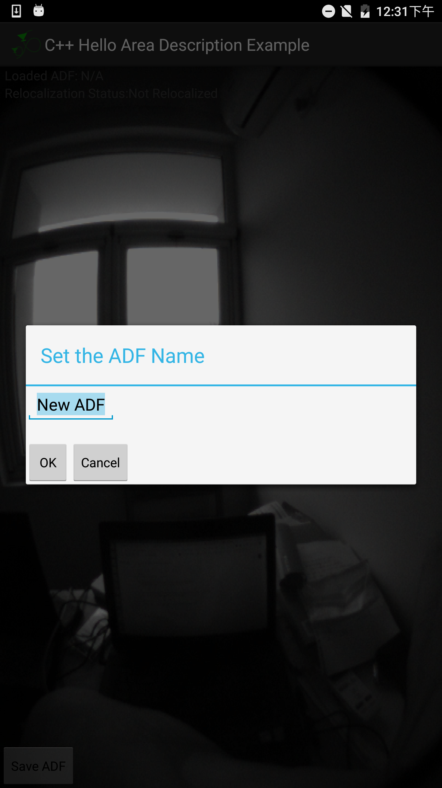
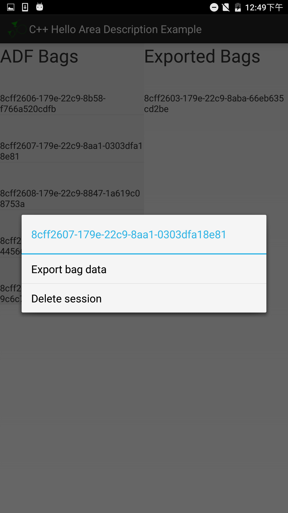

Project Tango C API Example Projects
===========================================
Copyright 2014 Google Inc.

Project Status
--------------
**Project Tango will be deprecated on March 1st, 2018, and will be moved to the [googlearchive](//github.com/googlearchive) Github organization. Access to the Tango API is unaffected (since it's an on-device APIs), but we will no longer support and update Tango.**

Useful Websites
---------------
SDK Download - https://developers.google.com/project-tango/downloads

Developer Website - https://developers.google.com/project-tango/apis/c

Contents
--------

This contains the Project Tango C API examples.

These examples use the Gradle build system and were developed using
Android Studio 2.1.

#### Basic Examples

The **cpp_basic_examples** project includes basic examples showing how
to compile and run an application using C/C++:

 * **hello_area_description** - Use the Area Description
   API to create and manage Area Description Files.
 * **hello_depth_perception** - Use the depth sensor.
 * **hello_motion_tracking** - Use the Motion Tracking API
   to track the position of the Tango device in 3D space.
 * **hello_video** - Render the RGB camera image using OpenGL.

#### Use Case Examples

Other examples in this repository show how to build an application for
different use cases of Tango technology:

 * **cpp_augmented_reality_example** - Achieve an augmented
   reality effect by rendering 3D objects overlaid on the camera image
   such that they appear to stay affixed in space.
 * **cpp_marker_detection_example** - Build an augmented reality appliction
   to detect Alvar markers in real world, and to render 3D objects over the
   markers.
 * **cpp_mesh_builder_example** - Use the depth sensor to
   build a mesh of the surrounding space.
 * **cpp_motion_tracking_example** - Use Tango motion
   tracking to navigate in a virtual 3D world.
 * **cpp_plane_fitting_example** - Build an AR application
   to detect planes in the real world to place objects in them.
 * **cpp_point_cloud_example** - Acquire and render a cloud
   of 3D points using the depth sensor.
 * **cpp_point_to_point_example** - Build a simple point-to-point
   measurement application using augmented reality and the depth
   sensor.
 * **cpp_rgb_depth_sync_example** - Synchronize the depth
   sensor 3D information with the color camera information.
 * **cpp_video_stabilization_experiment** - Stabilize the video by
   smoothing the pose and correcting for gravity.

The **cpp_example_util** project contains some common utility code that
is used for many samples.

### Tango fisheye and IMU logger

There are several apps to record images of the fisheye camera on Tango devices, 
notably, Tango ROS streamer, and Eyefish cam for Tango.
In my experience, [Tango ROS streamer](http://wiki.ros.org/tango_ros_streamer) publishes data from 
the depth camera, the color camera, and the fisheye camera, at a frequency 
[~15Hz](https://github.com/Intermodalics/tango_ros/issues/343) which is also discussed at [here](https://github.com/Intermodalics/tango_ros/issues/143),
and publishes data from the IMU.
[Eyefish cam for Tango](https://play.google.com/store/apps/details?id=com.bass.impact.eyefish&hl=en_US) 
takes pictures with the fisheye camera.
Both apps do not support accessing the fisheye camera with Android API >23, e.g., Asus Zenfone AR.

Our app developed from the Tango sample, 
[hello_area_description](https://github.com/googlearchive/tango-examples-c/tree/master/cpp_basic_examples/hello_area_description), 
records data from the fisheye camera at a frequency ~30Hz, 
and from the IMU at ~200Hz with Android API >=23.

#### Install apk with ADB
First of all, enable Developer option and USB debugging on the smartphone.
From a computer with ADB, the command to install the apk to the smartphone is 
```
adb install hello_area_description-release.apk
```
If failure "INSTALL_FAILED_UPDATE_INCOMPATIBLE or INSTALL_FAILED_ALREADY_EXISTS" crops up, you may need to
uninstall an existing hello_area_description app from the phone.


#### Start logging
To record data, open the app, C++ Hello Area Description Example, 
in the start screen, toggle Learning mode on,
then Click Start button to start logging data in a new screen.
For Lenovo Phab2, the new screen will display the captured fisheye images.
But for Asus Zenfone, the new screen does not show the fisheye images 
because Android API24 does not support accessing the fisheye camera.

#### Finish logging
To finish logging, press Save ADF button in the new screen.
A dialog comes up asking for a ADF name, click OK, as shown below. 



You do not need to change the default name 
because existing data with the same ADF name will not be overwritten.

After a few seconds, you should be back to the start screen and 
you may record another session as you will.

#### Extract logged data
But the recorded data are in a rosbag of arcane Tango messages, 
to access these data, you need to export them to ordinary files.
To export them, press the Export ADF Bags button in the start screen, 
in the next screen, you should see the list of ADF bags that have not been 
exported on the left and the list of ADF bags that have been exported on the right. 
Press on one ADF bag you would like to export for about 2 seconds, 
then a dialog will come up showing options like Export bag data as shown below.



Press Export bag data, wait for some time which depends on the length of the ADF bag, 
you should be able to see the exported bag on the right panel.

#### Transfer data
To copy recorded and exported data from the phone to a computer, 
it is highly recommended to use the ADB tool.
An example command line is
```
adb pull /sdcard/tango
```
where /sdcard/tango is dir in which the app's data are stored.

#### Bag data
To create a rosbag from the exported data, you may use the python script
[kalibr_bagcreater](https://github.com/JzHuai0108/vio_common/blob/dev/python/kalibr_bagcreater.py).

```
python kalibr_bagcreater.py --folder="/data-dir/8cff2603-179e-22c9-8aba-66eb635cd2be/export" \
 --imu="/data-dir/8cff2603-179e-22c9-8aba-66eb635cd2be/export/gyro_accel.csv" \
 --output_bag="/data-dir/8cff2603-179e-22c9-8aba-66eb635cd2be/awesome.bag"
```

Citing
------

If you use the logger for your research, please consider citing the paper.
```
@INPROCEEDINGS{huai2019mars, 
author={Jianzhu {Huai} and Yujia {Zhang} and Alper {Yilmaz}}, 
booktitle={2019 IEEE SENSORS}, 
title={The mobile AR sensor logger for Android and iOS devices}, 
year={2019}, 
volume={}, 
number={}, 
pages={},
ISSN={}, 
month={Oct},}
```


Support
-------
As a first step, view our [FAQ](http://stackoverflow.com/questions/tagged/google-project-tango?sort=faq&amp;pagesize=50)
page. You can find solutions to most issues there.

If you have general API questions related to Tango, we encourage you to
post your question to our [stack overflow
page](http://stackoverflow.com/questions/tagged/google-project-tango).

To learn more about general concepts and other information about the
project, visit [Project Tango Developer website](https://developers.google.com/project-tango/).

Contribution
------------
Want to contribute? Great! First, read this page (including the small
print at the end).

#### Before you contribute
Before we can use your code, you must sign the
[Google Individual Contributor License
Agreement](https://developers.google.com/open-source/cla/individual?csw=1)
(CLA), which you can do online. The CLA is necessary mainly because you
own the
copyright to your changes, even after your contribution becomes part of
our
codebase, so we need your permission to use and distribute your code. We
also
need to be sure of various other things—for instance, that you'll tell us
if you
know that your code infringes on other people's patents. You don't have
to sign
the CLA until after you've submitted your code for review and a member
has
approved it, but you must do it before we can put your code into our
codebase.
Before you start working on a larger contribution, you should get in
touch with
us first through the issue tracker with your idea so that we can help
out and
possibly guide you. Coordinating up front makes it much easier to avoid
frustration later on.

#### Code reviews
All submissions, including submissions by project members, require
review. We
use Github pull requests for this purpose.

#### The small print
Contributions made by corporations are covered by a different agreement
than
the one above: the Software Grant and Corporate Contributor License
Agreement.
